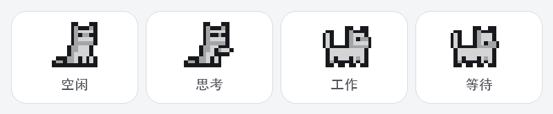

# ✨ Codex Monitor

<p align="center">
  
</p>

<p align="center">
  <strong>专为 Codex 打造的 macOS 菜单栏监控器</strong><br>
  不打开 Codex，也能随时查看额度、Token 和最近会话。
</p>

<p align="center">
  <a href="https://github.com/YS-BW/CodexMonitor/releases/latest"></a>
  <a href="https://github.com/YS-BW/CodexMonitor/releases"></a>
  
  
  
</p>

> Codex Monitor 是独立开源项目，与 OpenAI、ChatGPT 或 Codex 没有隶属关系。

## 👀 一眼看清 Codex

状态栏始终保留最重要的 **额度百分比**：同一只像素小猫会由 Codex Hooks 实时切换空闲、思考、工作和等待四种动作。点击后展开紧凑面板，所有模块都可以显示、隐藏和自由排序。

<p align="center">
  
</p>

### 🐈 四种任务状态

<p align="center">
  
</p>

小猫由 Codex Hooks 实时切换 **空闲、思考、工作、等待** 四种动作：提交任务后进入思考，调用工具时开始工作，需要确认时进入等待，任务结束后恢复空闲。动作切换带有轻量过渡，思考状态会保留足够时间，避免被第一个工具事件瞬间覆盖。

## ✨ 主要功能

### 🧩 真正的模块化面板

- 每个数据区都是独立模块，可按需要显示或隐藏。
- 直接拖动整个模块调整顺序，相邻模块会实时让位。
- 默认保持简洁，鼠标悬停或拖动时才显示半透明背景。
- 原生 SwiftUI 界面，自动适配 macOS 深色与浅色模式。

### 📊 额度与 Token

- 在菜单栏持续显示当前可用额度。
- 支持 **5h 额度**与**本周额度**，并显示重置时间。
- 额度充足、一般、偏低时分别使用蓝、黄、红三种进度条颜色。
- 汇总本机 Codex 的总 Token，以及今日、本周、本月 Token 消耗。
- 绘制最近 7 天趋势图；将鼠标精准移到数据点可查看当天用量并获得触控板反馈。

### 💬 最近会话

- 保留最近 3 个会话，显示真实标题、来源和 Token 用量。
- 识别 **Codex App / CLI / IDE** 来源。
- App 与 IDE 会话可直接跳回 Codex 对应页面。
- CLI 会话可在 Terminal 或 Ghostty 中执行 `codex resume` 继续工作。

### ⚡ 原生 Hooks 状态跟踪

- 首次启动一键完成 Hooks 安装与授权，不需要再进入 CLI 手动信任。
- 由任务事件直接驱动状态栏动画，不轮询任务日志，也不频繁唤醒 CPU。
- Hooks 只保存会话 ID、轮次 ID、状态与更新时间，不记录提示词、回复、文件内容或命令输出。

## 🧱 可用模块

| 模块 | 显示内容 |
| --- | --- |
| ⏱️ 5h 额度 | 短时额度剩余百分比与重置时间。 |
| 📅 本周额度 | 周额度剩余百分比与重置时间。 |
| ∑ 总 Token | 本机 Codex 日志中的累计 Token。 |
| ☀️ 今日 Token | 当地自然日内的 Token 消耗。 |
| 🗓️ 本周 Token | 当前自然周的 Token 消耗。 |
| 📆 本月 Token | 当前自然月的 Token 消耗。 |
| 📈 Token 趋势 | 最近 7 天每日消耗、本周总量、日均与峰值。 |
| 💬 最近会话 | 最近 3 个会话的标题、来源、Token 与活跃指示灯。 |

设置区采用横向滑动，模块再多也不会把面板无限撑长。刷新频率可选 **手动、1、5、15 或 30 分钟**。首次安装默认展示本周额度、总 Token、Token 趋势和最近会话，并每 1 分钟刷新一次。

## 🚀 安装

1. 前往 [Releases](https://github.com/YS-BW/CodexMonitor/releases/latest) 下载最新版 `CodexMonitor-*.dmg`。
2. 打开 DMG，将 **Codex Monitor.app** 拖入 **Applications**。
3. 启动 App。它只出现在菜单栏，不占用 Dock。
4. 首次启动会显示 Hooks 说明，点击 **安装并授权** 即可一次完成配置，不需要打开 CLI。
5. 如果 Codex Desktop 当时正在运行，请重新打开一次，让 Desktop 后台载入新的 Hooks。

首次使用前，请先在 Codex App 或 Codex CLI 中通过 ChatGPT 账号完成登录。**不需要 OpenAI API Key。**

> 当前安装包使用临时签名，尚未经过 Apple 公证。如果 macOS 阻止打开，请在“系统设置 → 隐私与安全性”中选择仍要打开。

## 🔐 数据与隐私

所有会话、任务和 Token 统计都在本机完成。Codex Monitor 不会上传你的会话内容，也不会把登录令牌发送给第三方。

| 本地数据 | 用途 |
| --- | --- |
| Codex 登录状态 | 优先使用 `~/.codex/auth.json` 快速查询；文件缺失、过期或凭据位于钥匙串时，自动通过本机 Codex 读取额度。 |
| Codex Hooks | 只接收任务开始、执行、等待和结束事件；仅保存会话 ID、轮次 ID、状态与更新时间。 |
| `~/.codex/sessions/` | 识别最近会话、来源和 Token 事件。 |
| `~/.codex/state_5.sqlite` | 读取 Codex 中的真实会话标题与线程信息。 |
| `~/.codex/goals_1.sqlite` | 在本地存在 Goal 数据时读取其状态。 |

刷新额度只是查询已有用量，**不会发起 Codex 推理，也不会消耗额度**。

## ⚡ 性能设计

- 启动时先显示上次缓存的额度，避免状态栏长时间出现空值。
- 额度与最近会话优先刷新，较重的 Token 汇总在后台完成。
- Token 扫描采用文件级增量缓存，只重新解析发生变化的日志。
- 小猫状态完全由 Codex Hooks 推送，不扫描任务日志，也不设置状态轮询。

## ✅ 系统要求

- macOS 26 或更高版本
- Apple Silicon Mac
- 已登录 Codex App 或 Codex CLI
- ChatGPT Plus，或其他支持 Codex 用量查询的账号

## ❓ 常见问题

<details>
<summary><strong>为什么任务开始后小猫没有切换动作？</strong></summary>

在设置中点击 Hooks 选项，按弹窗提示选择“安装并授权”。完成后不需要打开 CLI；如果 Codex Desktop 当时正在运行，请重新打开一次。
</details>

<details>
<summary><strong>为什么没有显示额度？</strong></summary>

确认这台 Mac 已在 Codex 中登录，再点击底部的“刷新”。不同账号返回的额度窗口可能不同，没有返回的数据模块会自动隐藏。
</details>

<details>
<summary><strong>为什么另一台 Mac 看不到原来的会话和 Token？</strong></summary>

这些信息来自当前电脑的 `~/.codex` 本地数据。Codex Monitor 不会跨设备同步日志，因此另一台 Mac 只能统计它本机已有的会话。
</details>

<details>
<summary><strong>为什么 CLI 会话没有在 Ghostty 中打开？</strong></summary>

在设置中选择 CLI 打开方式。首次调用时，macOS 可能要求允许 Codex Monitor 控制终端应用；如果没有安装 Ghostty，会自动回退到 Terminal。
</details>

<details>
<summary><strong>macOS 提示 App“已损坏”或无法打开怎么办？</strong></summary>

确认 DMG 来自本仓库的 Releases 后，在终端执行：

```bash
xattr -rd com.apple.quarantine /Applications/Codex\ Monitor.app
```

然后重新打开 App。
</details>

## 🛠️ 本地开发

```bash
# 调试构建
swift build

# 直接运行
swift run

# 生成带拖拽安装界面的 DMG
scripts/package-dmg.sh
```

项目结构：

```text
Sources/CodexMonitor/   App、数据读取与 Hooks 状态监听
Sources/CodexMonitorHookSupport/  Hooks 状态模型与本地存储
Vendor/Reorderable/     模块拖拽排序组件（MIT）
Packaging/              App Bundle 配置
scripts/                图标、宣传图与 DMG 构建脚本
docs/images/            README 与项目展示图片
```

第三方组件许可见 [THIRD_PARTY_NOTICES.md](THIRD_PARTY_NOTICES.md)。

菜单栏猫咪动画素材由 [Elthen's Pixel Art Shop](https://elthen.itch.io/2d-pixel-art-cat-sprites) 创作，并依据作者许可用于本项目。感谢 Elthen 提供这套精致的像素动画。🐾

## 🗺️ 当前限制

- 用量查询依赖 Codex 当前的本地登录格式和 ChatGPT 用量接口；上游格式变化时可能需要适配。
- 当前 Release 仅提供 Apple Silicon 构建。
- 安装包尚未使用 Apple Developer ID 公证。

## 💬 反馈与贡献

欢迎通过 [Issues](https://github.com/YS-BW/CodexMonitor/issues) 报告问题或提出建议。觉得有用，也欢迎点一个 Star ⭐️
