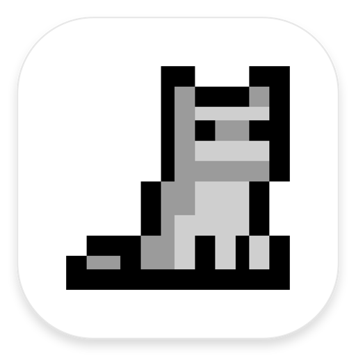
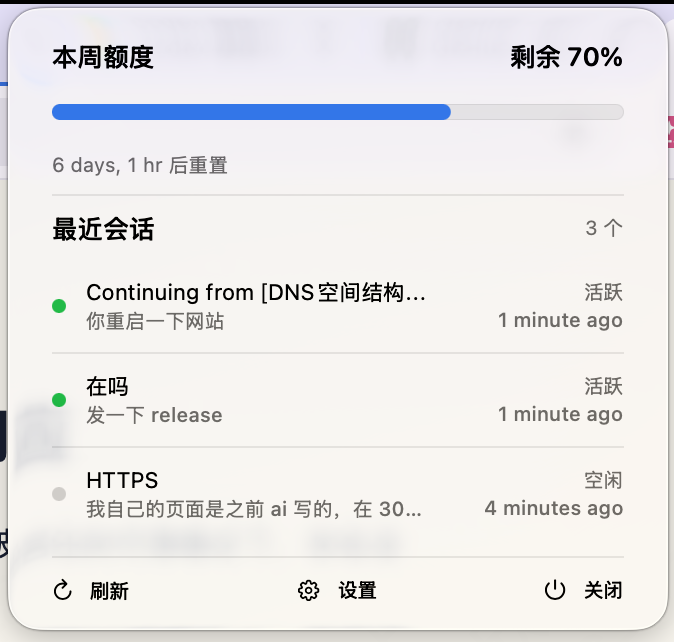

# ✨ Codex Monitor

<p align="center">
  
</p>

<p align="center">
  <strong>一个只存在于 macOS 菜单栏里的 Codex 用量与会话监控器。</strong><br>
  看额度、看最近会话、随时刷新，不打断工作流。
</p>

<p align="center">
  <a href="https://github.com/YS-BW/CodexMonitor/releases"></a>
  
  
  
</p>

> ⚠️ 这是独立开源项目，与 OpenAI、ChatGPT 和 Codex 均无隶属关系。

## 🖥️ 界面预览

用量、最近会话与底部操作都集中在一个紧凑的菜单栏面板中。

<p align="center">
  
</p>

## 🚀 快速安装

从 [GitHub Releases](https://github.com/YS-BW/CodexMonitor/releases) 下载最新版 `CodexMonitor-*.dmg`。

1. 打开 DMG。
2. 将 **Codex Monitor.app** 拖到 **Applications** 文件夹。
3. 打开 App；它只显示在菜单栏，不会出现在 Dock 中。

首次使用前，请先在 Codex 桌面 App 或 CLI 中完成 ChatGPT 登录。

> 当前安装包为临时签名、未经过 Apple 公证。如 macOS 阻止打开，请在“系统设置 → 隐私与安全性”中允许打开，或按下方常见问题处理。

## 👀 能看什么

| 模块 | 内容 |
| --- | --- |
| ⏱️ 5h 额度 | 当账号返回短时用量窗口时，显示剩余百分比与重置时间。 |
| 📅 本周额度 | 显示周额度剩余百分比与重置时间。 |
| 💬 最近会话 | 显示最近 3 个本地 Codex 会话的真实标题、最后一条用户消息预览和活跃状态。 |
| ⚙️ 显示设置 | 开关会话、周额度、5h 额度模块。 |

你可以直接拖拽完整模块来调整顺序；拖拽时会有触控板反馈。模块平时保持平面，悬停或拖拽时才显示系统天气风格的浅色高亮。

## 🧭 使用方式

- 菜单栏会显示当前可用额度；若只有周额度，显示周额度剩余值。
- 点击菜单栏图标打开面板。
- 底部提供 **刷新**、**设置** 和 **关闭** 操作。
- 刷新只读取本地登录态与用量信息，**不会消耗 Codex 额度**。

不同套餐和账号返回的用量窗口不完全相同；没有返回的模块会自动隐藏。

## 🔐 数据与隐私

Codex Monitor 不需要 OpenAI API Key，也不会把你的数据发送到第三方服务。

它在本机读取以下 Codex 数据，并仅用本机已有的 ChatGPT 登录令牌请求官方 ChatGPT 域名的用量信息：

- `~/.codex/auth.json`：读取已登录的访问令牌与账号标识，用于查询用量。
- `~/.codex/sessions/`：读取本地会话日志，用于最近会话列表和消息预览。
- `~/.codex/state_5.sqlite`：读取 Codex 侧边栏中的真实会话标题。

不会显示、上传或写回你的令牌内容。会话内容只在本机 UI 中截取一行预览。

## ✅ 系统要求

- macOS 26 或更高版本
- Apple Silicon Mac
- 已登录的 Codex 桌面 App 或 Codex CLI
- ChatGPT Plus / 支持 Codex 用量查询的账号

## ❓ 常见问题

### 没有显示额度

确认当前 Mac 已在 Codex 中登录。然后点击底部的 **刷新**。如果账号没有返回某个额度窗口，对应模块会自动隐藏。

### 最近会话为空或标题不对

最近会话来自本机 `~/.codex` 数据；另一台 Mac 不会自动拥有这台 Mac 的历史会话。标题优先读取 Codex 本地线程索引，旧会话缺少索引时会回退到首条用户消息。

### macOS 提示“无法打开”或“已损坏”

未公证的临时签名应用可能被 Gatekeeper 拦截。确认下载来源可信后，可在终端执行：

```bash
xattr -rd com.apple.quarantine /Applications/Codex\ Monitor.app
```

然后重新打开 App。

## 🛠️ 本地开发

```bash
# 调试运行
swift run

# 构建与检查
swift build

# 生成带拖拽安装界面的 DMG
scripts/package-dmg.sh
```

主要目录：

```text
Sources/CodexMonitor/   SwiftUI 菜单栏应用
Vendor/Reorderable/     拖拽排序依赖（MIT License）
Packaging/              App Bundle 配置
scripts/                图标与 DMG 安装器生成脚本
```

## 🧩 已知限制

- 用量数据依赖 Codex 本地登录文件与当前 ChatGPT 用量接口；官方格式变动后可能需要适配。
- 目前仅提供 Apple Silicon 构建。
- 当前版本未进行 Apple 公证。

## 💬 反馈

欢迎通过 [Issues](https://github.com/YS-BW/CodexMonitor/issues) 提交问题、设计建议或功能请求。喜欢的话，也欢迎点一个 Star ⭐️
